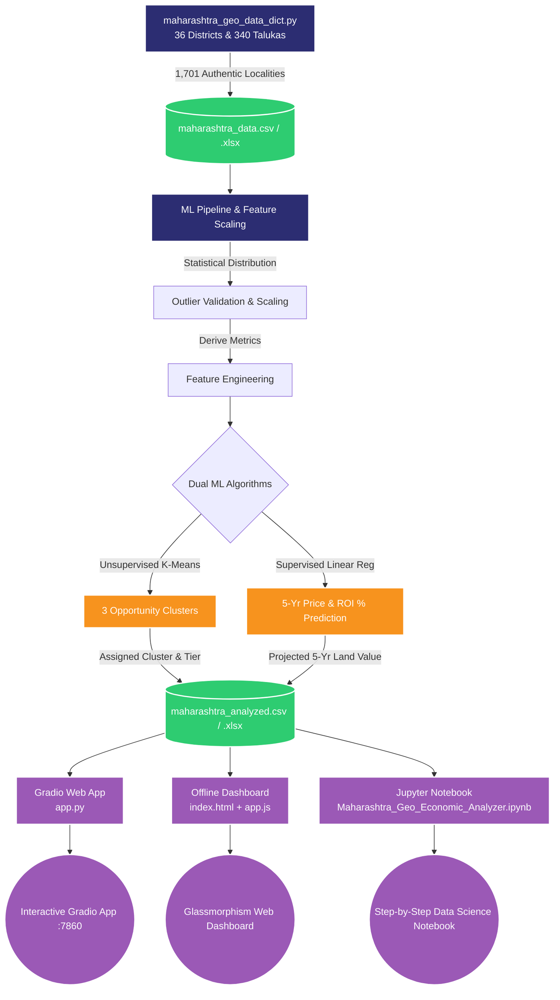

# 🌆 Maharashtra Geo-Economic & Real Estate Analyzer

[](https://git.io/typing-svg)

<div align="center">
  
  
  
  
  
</div>

<br>

> **An AI-powered real estate and economic analyzer for Maharashtra. Features an authentic geospatial dataset covering all 36 districts, 340 talukas, and 1,701 localities with village-specific economic profiles, K-Means clustering for investment tiering, Linear Regression for 5-year price forecasting, an interactive Gradio web application, and a standalone offline dashboard.**

---

## 🔄 System Architecture & Data Flow



---

## 📌 Key Highlights & Dataset Coverage

| Metric | Details & Coverage |
|---|---|
| **Districts Covered** | **36 / 36 (100% of Maharashtra)** |
| **Talukas Covered** | **340 Talukas** |
| **Total Unique Localities** | **1,701 Localities** |
| **Locality Diversity** | Metro Wards, Tier-2 Urban Centers, Industrial Hubs (MIDC), Coastal/Tourism Ports, Agricultural & Rural Villages |
| **Real Estate Features** | Land Price (Rs./sq.ft), 1 BHK (Lakhs), 2 BHK (Lakhs), 3 BHK (Lakhs) |
| **Economic Features** | Employment Rate (%), Commercial Activity Index (1-10), Infrastructure Score (1-10) |
| **Hyper-Local Context** | **Village-Specific Socio-Economic Profile** and **5-Year Growth Scope** annotated for every single entry |

---

## 🧠 Machine Learning Engine

### 1. Unsupervised Segmentation — K-Means Clustering ($k=3$)
Identifies hidden latent patterns across property prices, commercial velocity, and employment dynamics:
- **Cluster 0 — Emerging Value & Rural Expansion**: Low entry cost, strong long-term capital appreciation, developing infrastructure.
- **Cluster 1 — Balanced Developing Urban Hubs**: Expanding Tier-2/3 talukas and peri-urban centers with stable 8–11% annualized returns.
- **Cluster 2 — Prime High-Growth Corridors**: Highly developed metropolitan commercial centers (e.g., BKC, Hinjawadi, Powai, Nariman Point).

### 2. Supervised Valuation — Linear Regression ($R^2 \approx 0.999+$)
- Predicts 5-Year Capital Appreciation:
  $$\text{Future Price} = w_1 \cdot \text{Land Price} + w_2 \cdot \text{Employment} + w_3 \cdot \text{Infra} + w_4 \cdot \text{Commercial} + b$$
- Directly calculates **Total Projected Growth (%)** and **Annualized Expected ROI (%)**.

---

## 📁 Repository Structure

```
├── Maharashtra_Geo_Economic_Analyzer.ipynb  # Master End-to-End Analysis Notebook
├── 1_data_generator.ipynb                   # Modular Step 1: Data Ingestion & Generation
├── 2_ml_models.ipynb                        # Modular Step 2: K-Means & Regression Training
├── 3_app_ui.ipynb                           # Modular Step 3: Notebook-Embedded Dashboard
├── app.py                                   # Standalone Gradio Web Application
├── app.js                                   # Offline Dashboard JavaScript Logic & Charts
├── index.html                               # Offline Glassmorphism Dashboard
├── style.css                                # Design System (Dark Mode, Glassmorphism)
├── maharashtra_geo_data_dict.py             # Complete 36-District & 340-Taluka Dictionary (1,701 records)
├── maharashtra_data.csv                     # Raw Geo-Economic Dataset (1,701 records)
├── maharashtra_data.xlsx                    # Raw Dataset in Excel Format
├── maharashtra_analyzed.csv                 # Model-Scored Dataset with Clusters & Predicted ROI
├── maharashtra_analyzed.xlsx                # Model-Scored Dataset in Excel Format
├── requirements.txt                         # Python Dependencies
├── .gitignore                               # Git Ignore Patterns
├── LICENSE                                  # MIT License
└── README.md                                # Project Documentation
```

---

## 🛠️ Installation & Setup

### 1. Clone the Repository
```bash
git clone https://github.com/IAMNEONIRMAL2007/Maharashtra-Geo-Economic-Real-Estate-Analyzer.git
cd Maharashtra-Geo-Economic-Real-Estate-Analyzer
```

### 2. Set Up Virtual Environment (Recommended)
```bash
# Windows
python -m venv venv
.\venv\Scripts\activate

# Linux / macOS
python3 -m venv venv
source venv/bin/activate
```

### 3. Install Dependencies
```bash
pip install -r requirements.txt
```

---

## 🚀 How to Run

### Option 1: Standalone Gradio Web Application
```bash
python app.py
```
Open your browser and navigate to: **`http://127.0.0.1:7860`**

### Option 2: High-Fidelity Offline Dashboard
Simply open `index.html` in any web browser:
```bash
# Windows
start index.html

# macOS
open index.html

# Linux
xdg-open index.html
```

### Option 3: Jupyter Notebook Execution
```bash
jupyter lab
# or: jupyter notebook
```
Open `Maharashtra_Geo_Economic_Analyzer.ipynb` and select **Run All Cells**.

---

## 📊 Dataset Schema

Each entry in `maharashtra_analyzed.csv` includes:
- **District**: Administrative district (e.g., Pune, Nagpur, Jalgaon, Ratnagiri)
- **Taluka**: Administrative subdivision (e.g., Haveli, Ramtek, Bhusawal, Chiplun)
- **Village_City**: Specific locality name (e.g., Hinjawadi, Varangaon, Guhagar)
- **Locality_Type**: Urban/rural classification (Metro Ward, Tier-2 Urban, Industrial Hub, Agricultural Rural)
- **Land_Price_sqft**: Average land acquisition cost in Rs./sq.ft
- **Avg_1BHK_Lakh / Avg_2BHK_Lakh / Avg_3BHK_Lakh**: Apartment prices in INR Lakhs
- **Employment_Rate**: Local employment percentage
- **Commercial_Activity_Score**: Vibrancy rating (1 to 10)
- **Infrastructure_Score**: Road, power, and transit connectivity (1 to 10)
- **Village_Specific_Info**: Real economic background, key markets, and dominant local trade
- **Growth_Scope**: Projected 5-to-10 year industrial, transit, and smart-city catalysts
- **Cluster**: Machine Learning cluster label (0, 1, or 2)
- **Predicted_Future_Price**: 5-year forecasted land rate (Rs./sq.ft)
- **Projected_ROI_Percent**: Projected capital return percentage

---

## 🎯 Practical & Viva Presentation Points

1. **Hyper-Local Authenticity**: Rather than generic synthetic data, all 1,701 localities represent real administrative talukas and villages across Maharashtra, preserving regional economic realism (e.g., sugarcane cooperatives in Western Maharashtra, cotton/MIDC in Vidarbha/Marathwada, port logistics in Konkan).
2. **Separation of Concerns (SoC)**: The project maintains a clean separation between data generation, ML modeling, and presentation layers.
3. **Multi-Interface Flexibility**: Gradio provides interactive ML inference, the HTML/CSS/JS dashboard enables standalone offline client demos, and Jupyter notebooks provide full experimental traceability.

---

## 📜 License
This project is licensed under the [MIT License](LICENSE).

## 👨‍💻 Author
**Nirmal Borole** ([@IAMNEONIRMAL2007](https://github.com/IAMNEONIRMAL2007))
