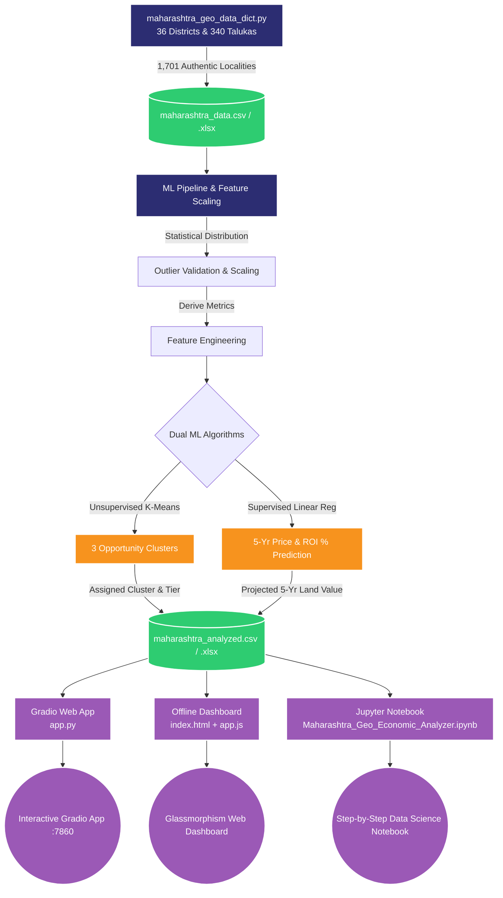

## 🔄 System Architecture & Data Flow

```mermaid
graph TD
    %% Data Layer
    A[maharashtra_geo_data_dict.py<br>36 Districts & 340 Talukas] -->|1,701 Authentic Localities| B[(maharashtra_data.csv / .xlsx)]
    
    %% ML Layer
    B --> C[ML Pipeline & Feature Scaling]
    C -->|Statistical Distribution| D[Outlier Validation & Scaling]
    D -->|Derive Metrics| E[Feature Engineering]
    
    %% Split Models
    E --> F{Dual ML Algorithms}
    F -->|Unsupervised K-Means| G[3 Opportunity Clusters]
    F -->|Supervised Linear Reg| H[5-Yr Price & ROI % Prediction]
    
    %% Output Data Layer
    G -->|Assigned Cluster & Tier| I[(maharashtra_analyzed.csv / .xlsx)]
    H -->|Projected 5-Yr Land Value| I
    
    %% Presentation Multi-Engine
    I --> J1[Gradio Web App<br>app.py]
    I --> J2[Offline Dashboard<br>index.html + app.js]
    I --> J3[Jupyter Notebook<br>Maharashtra_Geo_Economic_Analyzer.ipynb]
    
    %% Live Interfaces
    J1 --> K1((Interactive Gradio App :7860))
    J2 --> K2((Glassmorphism Web Dashboard))
    J3 --> K3((Step-by-Step Data Science Notebook))
    
    %% Styling
    classDef file fill:#2C2D72,stroke:#fff,stroke-width:2px,color:#fff;
    classDef data fill:#2ECC71,stroke:#fff,stroke-width:2px,color:#fff;
    classDef model fill:#F7931E,stroke:#fff,stroke-width:2px,color:#fff;
    classDef ui fill:#9B59B6,stroke:#fff,stroke-width:2px,color:#fff;
    
    class A,C file;
    class B,I data;
    class G,H model;
    class J1,J2,J3,K1,K2,K3 ui;
```

---